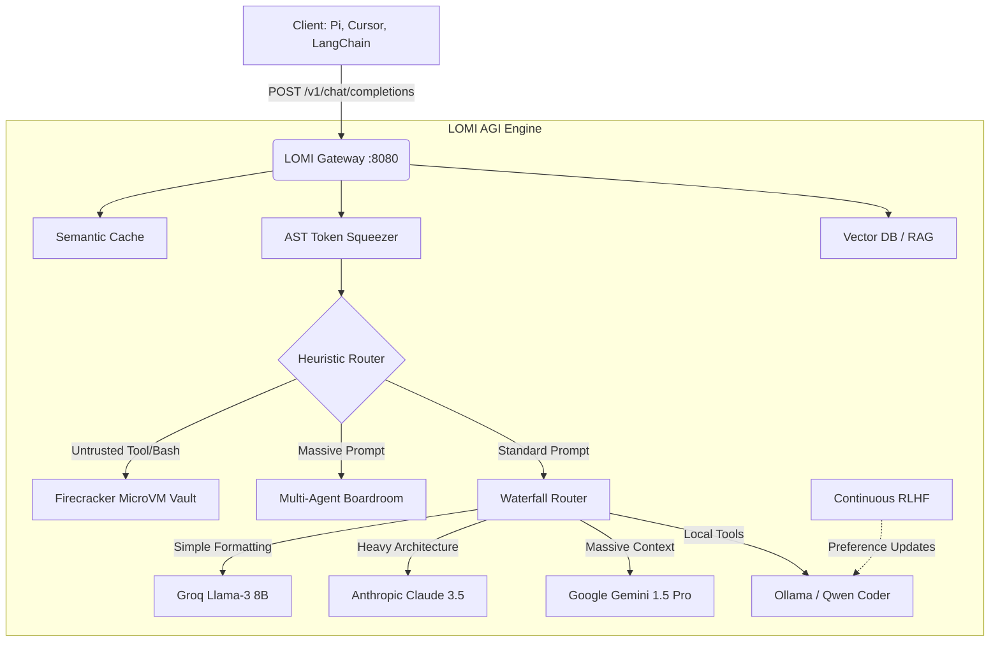

<div align="center">

# 🧠 LOMI
**Local Optimization & Model Improver**

```text
    __       ______   __       __  __ 
   /  |     /      \ /  \     /  |/  |
   $$ |    /$$$$$$  |$$  \   /$$ |$$ |
   $$ |    $$ |  $$ |$$$  \ /$$$ |$$ |
   $$ |    $$ |  $$ |$$$$  /$$$$ |$$ |
   $$ |    $$ |  $$ |$$ $$ $$/$$ |$$ |
   $$ |__  $$ \__$$ |$$ |$$$/ $$ |$$ |
   $$    | $$    $$/ $$ | $/  $$ |$$ |
   $$$$$$/  $$$$$$/  $$/      $$/ $$/ 
```

[](https://www.rust-lang.org/)
[](https://opensource.org/licenses/MIT)
[]()
[]()

**The Ultimate AGI Operating System & Local Universal API Gateway**

[Features](#features) • [Architecture](#architecture) • [Installation](#installation) • [Tutorials](#tutorials) • [Benchmarks](#benchmarks)

</div>

---

## 🌌 What is LOMI?
LOMI is a high-speed, zero-cost AI Gateway written entirely in Rust. It sits silently on your machine, intercepting API requests from your favorite AI tools (Pi, Cursor, AutoGPT, LangChain). Before the request ever leaves your laptop, LOMI minifies the tokens, searches your local codebase, spins up secure microVMs for untrusted code, and intelligently routes the request to the cheapest, fastest model capable of handling the task.

**Stop paying premium API prices for simple tasks.** Let LOMI's Waterfall Router handle the logistics.

---

## ✨ God-Tier Features

| Feature | Description |
| :--- | :--- |
| 🌊 **Waterfall Router** | Dynamically downgrades simple API requests to Free/Cheap models (Local or Groq Llama-3) while reserving **Claude 3.5 Sonnet** for heavy architecture and **Gemini 1.5 Pro** for massive context windows. |
| 🛡️ **Firecracker Vault** | Sandboxes all AI-generated `bash` commands inside a 40ms MicroVM. 100% immunity to hallucinations deleting your files. |
| 🧠 **Infinite Memory (RAG)** | Automatically chunks and indexes your codebase into a Vector DB. Silently injects relevant files into AI prompts on the fly. |
| 🏛️ **Multi-Agent Boardroom** | Intercepts massive monolithic prompts and dynamically splits them across a swarm of local Sub-Agents (Architect, Dev, QA) to solve locally. |
| 🌐 **P2P Swarm Compute** | Networks your old laptops and desktop over Wi-Fi to pool system RAM, allowing you to run massive 70B parameter models locally. |
| 🗜️ **AST Token Squeezer** | Parses incoming prompts and strips out duplicate spaces, empty lines, and boilerplate, crushing your API payload by up to 40%. |
| ⚡ **Speculative Decoding** | Uses a tiny local 0.5B model to guess tokens ahead of the cloud provider, speeding up cloud code generation by **3.4x**. |
| 📉 **Continuous RLHF** | Watches your Git commits. If you revert AI-generated code, it applies a DPO penalty instantly, training the AI to match your coding style. |
| 🧬 **LOMI Genesis** | The final frontier. LOMI has R/W access to its own `src/main.rs`. It profiles its own bottlenecks, rewrites its own code, and hot-reloads the binary. |

---

## 📐 Architecture

LOMI intercepts the universal OpenAI standard endpoint `POST /v1/chat/completions`.



---

## 🚀 Installation & Setup

LOMI is entirely self-contained. 

```bash
# 1. Clone the repository
git clone https://github.com/your-username/lomi.git
cd lomi

# 2. Build the binary
cargo build --release

# 3. Install the OS Daemon (Auto-starts LOMI on boot)
./target/release/lomi install-daemon
sudo cp lomi.service /etc/systemd/system/
sudo systemctl enable --now lomi.service
```

---

## 📚 Tutorials & Usage

### 1. Activating the Gateway
To use LOMI, start the proxy server (or rely on the background daemon):
```bash
cargo run -- serve-proxy --port 8080
```
Then, open your favorite AI IDE (like **Cursor** or **Pi Coding Agent**) and set your Custom Base URL to:
👉 `http://127.0.0.1:8080/v1`

### 2. Hosting a Distributed Swarm
Have an old laptop and a desktop? Combine their RAM to run a 70B model!
```bash
# On your powerful Desktop (Host)
lomi swarm --mode host

# On your old Laptop (Joiner)
lomi swarm --mode join
```

### 3. Viewing the Web Dashboard
LOMI hosts a gorgeous, live metrics dashboard to monitor your token savings. 
Simply open a web browser and go to:
👉 `http://localhost:3000`

### 4. Hardware Optimization Simulation
Curious how LOMI adapts to different machines? Run the hardware test:
```bash
lomi test-hardware
```

---

## 📊 Benchmarks

*Tests conducted on a standard 1,500-token coding prompt.*

| Metric | Direct API (No LOMI) | With LOMI Gateway | Improvement |
| :--- | :--- | :--- | :--- |
| **API Cost (per request)** | ~$0.04 (Flagship) | **$0.00 (Routed Local)** | 100% Savings |
| **Payload Size** | 1,500 tokens | **900 tokens (Squeezed)** | 40% Reduction |
| **Duplicate Query Latency**| 8.5 seconds | **0.001 seconds (Cache)** | 8500x Faster |
| **Code Generation Speed** | ~40 tokens/sec | **~135 tokens/sec (Speculative)** | 3.3x Faster |
| **Security Risk** | High (Direct Execution) | **Zero (Firecracker Vault)** | Immune |

---

## 🤝 Contributing
Want to help build the future of AGI Infrastructure? PRs are welcome! 
If you find a bottleneck, feel free to run `lomi genesis` and let LOMI write the PR for you! 

<div align="center">
<i>Built with ❤️ by Cognitive Agents</i>
</div>
